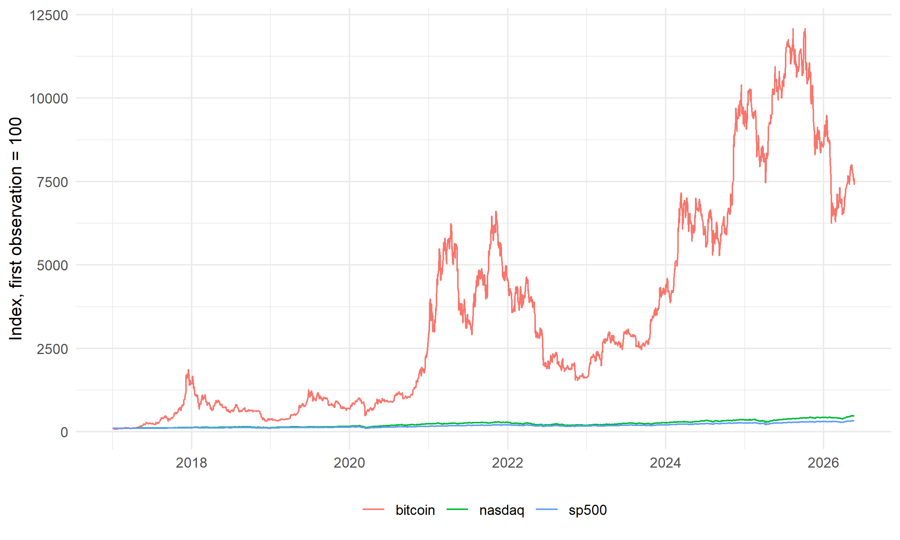
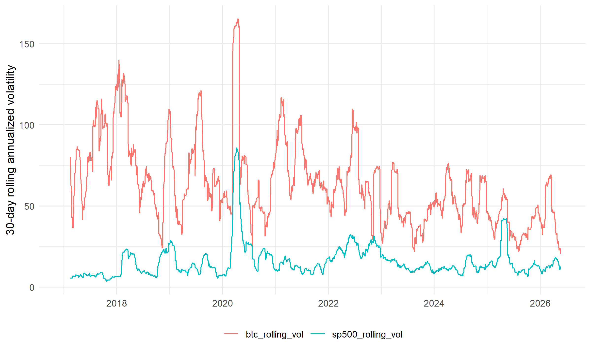
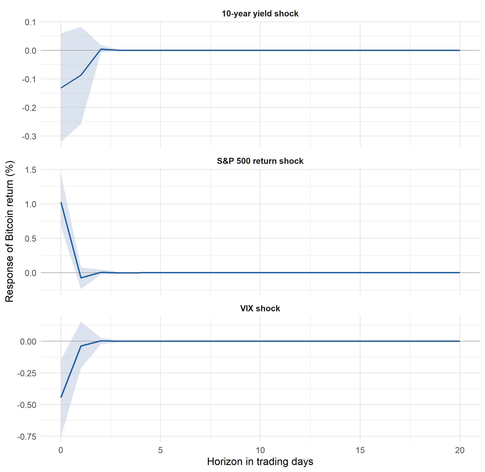

# Bitcoin Risk-Asset Analysis

This repository contains a reproducible Financial Econometrics project analysing whether Bitcoin behaves like a risky financial asset. The analysis compares Bitcoin with U.S. equity-market returns, market uncertainty, interest-rate changes, and the U.S. dollar index using public daily data from FRED.

**Main result:** Bitcoin shows clear risky-asset characteristics in this sample: high volatility, fat-tailed returns, persistent volatility clustering, positive contemporaneous correlation with S&P 500 returns, and negative contemporaneous correlation with VIX changes. However, the selected VAR specification does not provide strong evidence that lagged equity, volatility, or interest-rate variables predict next-day Bitcoin returns.

## Research Question

Does Bitcoin behave like a risky financial asset, and do equity-market, uncertainty, and interest-rate shocks help explain Bitcoin returns?

## Methods

The project uses a compact time-series workflow:

- Daily return and change transformations
- Summary statistics and correlation analysis
- Unit-root checks
- ARIMA modelling for Bitcoin mean-return dynamics
- GARCH(1,1) modelling for volatility clustering
- VAR modelling, Granger-causality tests, and impulse-response functions

The methodology is intentionally simple and close to the original academic project. The goal is to demonstrate applied financial econometrics and reproducible analysis rather than production software engineering.

## Data

Data are downloaded from FRED using public CSV endpoints, so no FRED API key is required.

Main series:

- `CBBTCUSD`: Coinbase Bitcoin price in U.S. dollars
- `SP500`: S&P 500 index
- `NASDAQCOM`: Nasdaq Composite index
- `VIXCLS`: CBOE VIX index
- `DGS10`: 10-year U.S. Treasury yield
- `DTWEXBGS`: Nominal broad U.S. dollar index

The saved project outputs use a sample from 2017-01-04 to 2026-05-21 with 2,341 common business-day observations. Re-running the download script later may update the raw data and slightly change the results.

## Key Figures







## Repository Structure

```text
.
|-- R/
|   |-- 00_setup.R
|   |-- 01_download_data.R
|   |-- 02_prepare_data.R
|   |-- 03_descriptives.R
|   |-- 04_arima_garch.R
|   |-- 05_var_analysis.R
|   |-- run_all.R
|   `-- utils.R
|-- data/
|   |-- raw/
|   `-- processed/
|-- output/
|   |-- figures/
|   |-- tables/
|   `-- model_summaries/
|-- report/
|   |-- bitcoin_project_report.Rmd
|   `-- bitcoin_project_report.pdf
|-- DESCRIPTION
`-- README.md
```

## How To Reproduce

Open R or RStudio from the repository root and run:

```r
source("R/00_setup.R")
source("R/run_all.R")
```

The workflow downloads the raw data, prepares the transformed dataset, and recreates the tables, figures, and model summaries in `output/`.

## Main Outputs

- `output/tables/summary_statistics.csv`
- `output/tables/correlation_matrix.csv`
- `output/tables/arima_forecast_accuracy.csv`
- `output/tables/garch_coefficients.csv`
- `output/tables/granger_tests_btc_equation.csv`
- `output/tables/var_model_info.csv`
- `output/figures/indexed_prices.png`
- `output/figures/rolling_volatility.png`
- `output/figures/combined_irfs_to_btc.png`

## Limitations

This is an academic coursework project, not an investment model. The analysis uses daily data, a compact VAR specification, and a limited set of market variables. The results should be interpreted as evidence about historical co-movement and volatility behaviour, not as a trading strategy or causal claim.

Possible extensions include subsample analysis, additional liquidity or macro-financial variables, robustness checks with alternative lag lengths, and multivariate volatility models.

## Contribution And AI Use

This repository is based on a Financial Econometrics academic project completed during my MSc studies. The public GitHub version was organized and documented with AI assistance. The repository is presented as evidence of applied econometrics, data handling, and reproducible analytical workflow, without claiming production-level software engineering or independent research impact.
